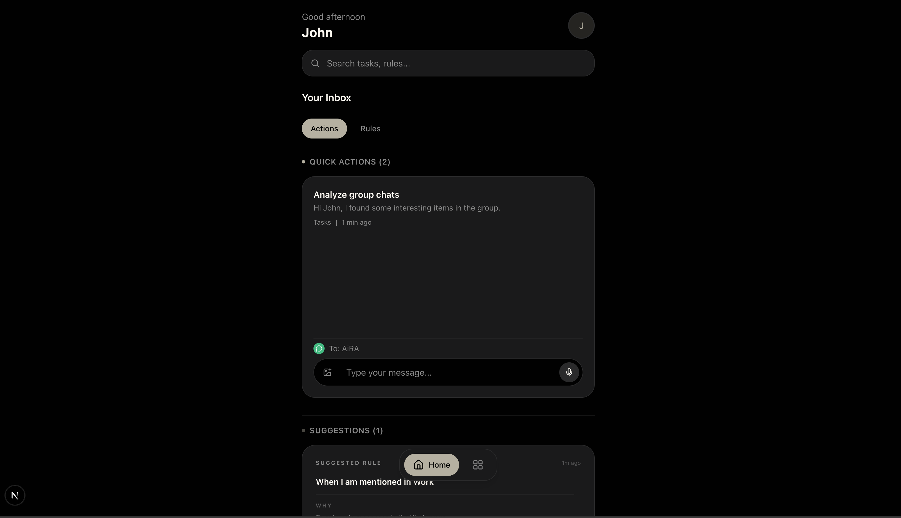
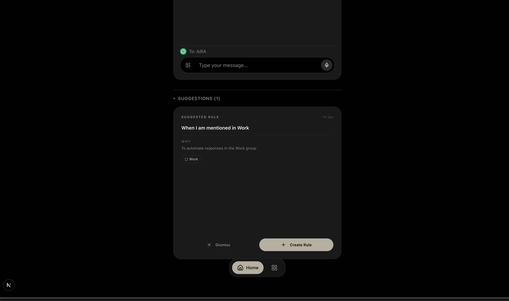
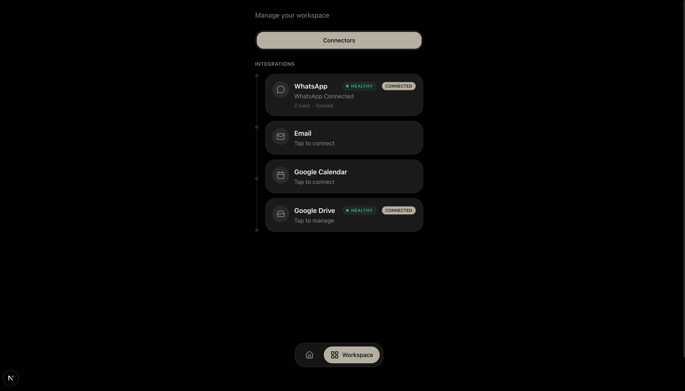

# 🤖 AiRA — Frontend Engineering Assignment

This repository contains my submission for the AiRA Frontend Engineering role. I have focused on transforming the experience from an opaque background process into a transparent, high-trust control plane.

---

## 🎯 The Mission: Solving "Automation Uncertainty"

The biggest hurdle for AI tools is the **Trust Gap**. Users give an AI control over their digital life but often feel uncertain about whether it's actually working. My contribution focuses on **Observability** and **Reliability**.

---

## ✨ Changes & Improvements

### 1. Unified "Actions" Hub & Guided Onboarding
- **The Solve**: I consolidated "Quick Actions" and "Suggestions" into a single, high-leverage **Actions** tab. This creates a unified entry point for all manual and AI-suggested interventions.
- **Onboarding Boost**: Replaced empty states with a **Template Injection System**. New users are greeted with actionable rule templates that pre-populate the creation flow, eliminating "blank page" paralysis.

````carousel

<!-- slide -->

````

### 2. Rule "Pulse" & Clickable Observability
- **The Solve**: Rules now feature **Health Badges** and a live **Pulse Indicator** that derive liveness from metadata. The status text is now **clickable**, taking users directly to the schedule settings for immediate control.


### 3. Service Connectivity Heartbeat
- **The Solve**: Surfaced connector health directly in the workspace. This prevents "Silent Failures" (e.g., an expired WhatsApp/WAHA session) and builds immediate confidence in the system's status.



---

## 🛠️ Technical Highlights

- **TanStack Query Transformations**: Used `select` hooks to compute system health states from raw API metadata, keeping the UI logic clean and performant.
- **Zustand for Cross-Tab State**: Implemented a global draft store to handle template injection, allowing users to move from "Actions" to "Rule Creation" without losing context.
- **Optimistic UI**: Rule toggles and sync actions feel instantaneous, providing immediate feedback while the server synchronizes.
- **Hydration Resilience**: Implemented `suppressHydrationWarning` on core layout components to ensure a seamless experience even with aggressive browser extensions.

---

## 🚀 Future Roadmap: Scaling Reliability

To take the "Reliability Engine" even further, I would implement:

1. **Dry Run Mode**: A "Sim-Test" feature allowing users to preview rule behavior against their last 50 messages before actual activation.
2. **Instruction Linting**: Client-side validation to detect and prevent conflicting or non-deterministic AI logic loops.
3. **Granular Sync Monitoring**: SSE-driven progress bars (replacing standard spinners) to show real-time indexing status for WhatsApp and Gmail chats.

---
**Vivek Dagar** | [GitHub](https://github.com/alwaysvivek) | [LinkedIn](https://linkedin.com/in/vivekdagar)
